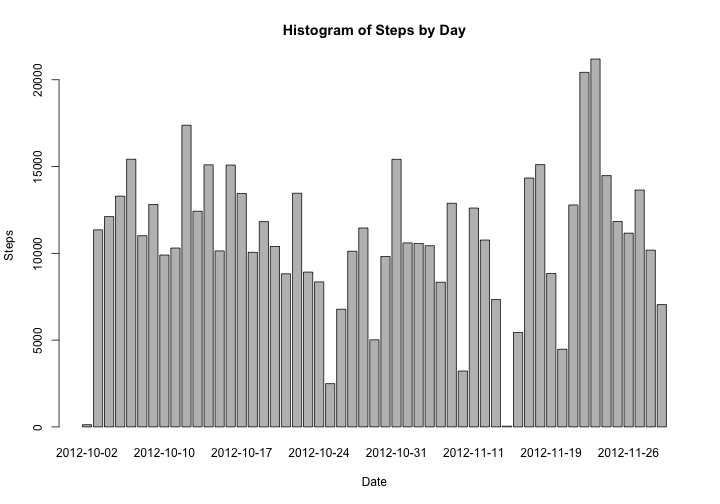
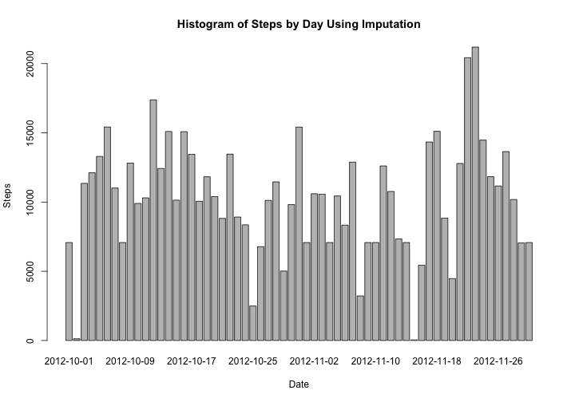

# Reproducible Research: Peer Assessment 1

## Set some global options


```r
require(knitr,quietly=T)
options(digits=2)
opts_chunk$set(comment=NA, echo = TRUE, fig.path = "figures/", fig.width=10, fig.height=7)
```

## Loading and preprocessing the data


```r
df <- read.csv(unz("activity.zip","activity.csv"))
```

## What is mean total number of steps taken per day?

```r
stepsByDay <- aggregate(steps ~ date,df,sum)
barplot(stepsByDay$steps,names.arg=stepsByDay$date,ylab="Steps",xlab="Date")
title("Histogram of Steps by Day")
```

 

```r
meanSteps <- sprintf("%8.2f",mean(stepsByDay[,"steps"]))
medianSteps <- sprintf("%8.2f",median(stepsByDay[,"steps"]))
```

### The mean number of steps per day across all days is 10766.19

### The median number of steps per day across all days is 10765.00

## What is the average daily activity pattern?


```r
stepsByInt <- aggregate(steps ~ interval,df,mean)
plot(stepsByInt$interval/100,stepsByInt$steps,type="l",xlab="Hour of Day",ylab="Mean Steps")
title("Average Daily Activity Pattern")
```

 

```r
maxIntervalData = stepsByInt[which.max(stepsByInt[,"steps"]),]
maxSteps <- maxIntervalData[,"steps"]
maxInterval <- maxIntervalData[,"interval"]
maxIHr <- trunc(maxInterval / 100)
maxIMi <- maxInterval %% 100;
maxPeriod <- sprintf("%02d:%2d to %02d:%2d",maxIHr,maxIMi,maxIHr,maxIMi+4)
```

### On average, the maxmimum number of steps, 206.17, was taken from 08:35 to 08:39


## Imputing missing values

```r
missing <- nrow(df[is.na(df$steps),])
```

### There are 2304 measurement intervals with missing values.

### Replacing missing values with average number of steps per period across all days.


```r
ndf <- df

for(i in 1:nrow(ndf)) {
      if(is.na(ndf[i,"steps"])) {
          intind <- ndf[i,"interval"] / 5 + 1
          ndf[i,"steps"] <- stepsByInt[intind,"steps"]
      }
}

stepsByDay <- aggregate(steps ~ date,ndf,sum)
barplot(stepsByDay$steps,names.arg=stepsByDay$date,ylab="Steps",xlab="Date")
title("Histogram of Steps by Day Using Imputation")
```

 

```r
meanSteps <- sprintf("%8.2f",mean(stepsByDay[,"steps"]))
medianSteps <- sprintf("%8.2f",median(stepsByDay[,"steps"]))
```

### By imputing missing data from averages for intervals, the mean number of steps per day across all days is 10282.14

### By imputing missing data from averages for intervals, the median number of steps per day across all days is 10395.00

### Both the mean and the median for the data set with imputed values are lower than the ones from the data set with NA's.


## Are there differences in activity patterns between weekdays and weekends?

```r
par(mfrow=c(2,1))

weekdy <- weekdays(as.Date(ndf[,"date"])) %in% c("Monday","Tuesday","Wednesday",
                                                 "Thursday","Friday")
weeknd <- weekdays(as.Date(ndf[,"date"])) %in% c("Saturday","Sunday")
stepsByIntWD <- aggregate(steps ~ interval,ndf[weekdy,],mean)
stepsByIntWE <- aggregate(steps ~ interval,ndf[weeknd,],mean)

maxx <- max(stepsByInt[,"interval"]) / 100
maxy <- max(stepsByInt[,"steps"])

plot(stepsByIntWD$interval/100,stepsByIntWD$steps,type="l",xlab="Hour of Day",ylab="Mean Steps",
     xlim=c(0,maxx),ylim=c(0,maxy))
title("Average Weekday Activity Pattern")

plot(stepsByIntWE$interval/100,stepsByIntWE$steps,type="l",xlab="Hour of Day",ylab="Mean Steps",
     xlim=c(0,maxx),ylim=c(0,maxy))
title("Average Weekend Activity Pattern")
```

 

### During weekends, getting out of bed seems to be later than during the week, and weekend activity seems to be higher.
